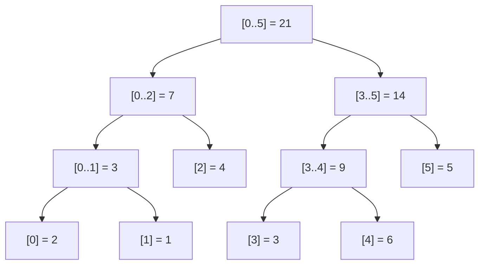
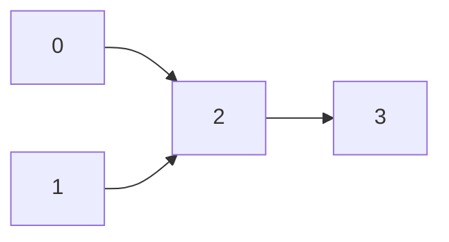
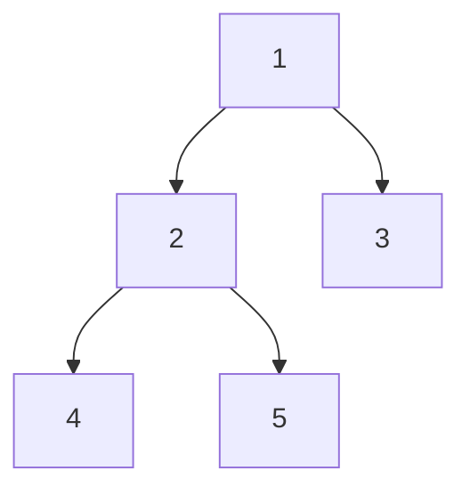
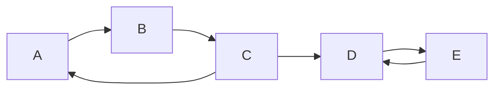
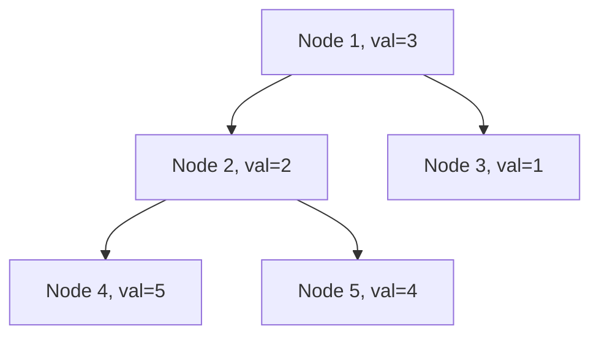

# 🧠 Last-Minute DSA + STL Revision

> **Who this is for:** Someone who has studied DSA before and needs fast recall — not first-time learners.
> Each section leads with a *mental model / visual intuition* first, then code, then traps.

---

## 📖 Table of Contents

| # | Section |
|---|---------|
| 1 | [⚡ Recognition Triggers](#1--recognition-triggers) |
| 2 | [🏗️ Data Structures & Techniques](#2--data-structures--techniques) |
| 3 | [🗺️ Graph Algorithms](#3--graph-algorithms) |
| 4 | [🧩 Dynamic Programming Patterns](#4--dynamic-programming-patterns) |
| 5 | [🔢 Math Tricks](#5--math-tricks) |
| 6 | [🔤 String Algorithms](#6--string-algorithms) |
| 7 | [🛠️ STL Cheat Sheet](#7--stl-cheat-sheet) |
| 8 | [⚖️ Confused-Technique Comparison Tables](#8--confused-technique-comparison-tables) |
| 9 | [💣 Common OA Traps](#9--common-oa-traps) |
| 10 | [🏁 Final 15–30 Minute Skim](#10--final-1530-minute-skim) |

---

## 1. ⚡ Recognition Triggers

> **Read this first. This is your mental lookup table.**

| Problem smells like... | Think |
|---|---|
| "Number of subarrays/substrings with sum/property X" | Prefix sum + hashmap, or two pointers if monotonic |
| "Range sum/update queries, many of them" | Fenwick / Segment Tree |
| "Range min/max, no updates" | Sparse Table (O(1) query) |
| "Range min/max WITH updates" | Segment Tree |
| "Next greater/smaller element" | Monotonic stack |
| "Sliding window max/min" | Monotonic deque |
| "Connectivity / grouping / dynamic components" | DSU |
| "Minimize max, or 'find smallest X such that condition holds'" | Binary search on answer |
| "Shortest path, all weights positive" | Dijkstra |
| "Shortest path, negative weights or need cycle detection" | Bellman-Ford |
| "Shortest path, all pairs, small N (≤400)" | Floyd-Warshall |
| "Shortest path, weights only 0/1" | 0-1 BFS (deque) |
| "Minimum cost to connect everything" | MST (Kruskal/Prim) |
| "Order tasks with dependencies" | Topological sort |
| "Subsequence + small N (≤20)" | Bitmask DP |
| "Count numbers in range with digit property" | Digit DP |
| "LIS / LDS or 'longest chain'" | Patience sorting O(n log n) |
| "Substring/pattern matching" | KMP / Z-function / hashing |
| "Palindromic substrings" | Manacher / expand-around-center / hashing |
| "XOR of subarray/pair maximization" | Trie on bits |
| "kth smallest / order statistics dynamically" | ordered_set (PBDS) or Fenwick over ranks |
| "Median of stream" | Two heaps |
| "Repeated identical subtree/array/state queries" | Memoize with map, or hashing states |
| "Tree + subtree sum/count queries" | Euler tour + Fenwick |
| "Tree + ancestor queries" | Binary lifting (LCA) |
| "Interval scheduling / merging / max non-overlapping" | Greedy sort by end time |
| "Something about parentheses/brackets validity" | Stack |
| "Matrix exponentiation smell (linear recurrence, huge n)" | Fast matrix power |
| "Modular arithmetic + large exponent" | Fast power + Fermat inverse |

---

## 2. 🏗️ Data Structures & Techniques

---

### 2.1 DSU (Union-Find / Disjoint Set)

#### 🧠 Mental Model

Imagine a forest of trees. Each tree = one group/component. Every node points to its root (the "representative").

```
Initially:    0  1  2  3  4      (each is its own group)
After unite(0,1):
              0←1  2  3  4      (1's parent is 0; 0 is the root)
After unite(2,3):
              0←1  2←3  4
After unite(1,2):
              0←1←2←3  4        (all in one component now)

Path compression: on find(3), we flatten:
              all point directly to 0
```

- `find(x)` → traces up to the root, compresses the path
- `unite(a, b)` → joins two trees; attach smaller tree under larger (union by rank/size)

**When to use:** Connectivity, Kruskal's MST, cycle detection in undirected graphs, "number of islands" with merges, offline connectivity.

**Complexity:** ~O(α(n)) ≈ O(1) amortized per op with both optimizations.

```cpp
struct DSU {
    vector<int> par, rnk;
    DSU(int n) : par(n), rnk(n, 0) { iota(par.begin(), par.end(), 0); }
    int find(int x) { return par[x] == x ? x : par[x] = find(par[x]); }  // path compression
    bool unite(int a, int b) {
        a = find(a); b = find(b);
        if (a == b) return false;           // already same component
        if (rnk[a] < rnk[b]) swap(a, b);   // attach smaller under larger
        par[b] = a;
        if (rnk[a] == rnk[b]) rnk[a]++;
        return true;
    }
    bool same(int a, int b) { return find(a) == find(b); }
};
```

> **⚠️ Traps:**
> - Always compress path in `find` — skipping degrades to O(n) per op.
> - If you need "size of component", maintain a `sz[]` updated in `unite`, not `rnk`.
> - DSU only ever merges — no un-union. For offline deletions, process queries in reverse.

**🔗 Practice Problems:**
- [Number of Provinces](https://leetcode.com/problems/number-of-provinces/) (LC 547) — Classic DSU
- [Redundant Connection](https://leetcode.com/problems/redundant-connection/) (LC 684) — Cycle detection
- [Number of Islands II](https://leetcode.com/problems/number-of-islands-ii/) (LC 305) — Online connectivity

---

### 2.2 Segment Tree

#### 🧠 Mental Model

Think of it as a **divide-and-conquer structure stored as an array**. Recursively split the array in half; each node stores the aggregate (sum/min/max/gcd) of its range. Node `i` has children `2i` (left) and `2i+1` (right).



> **Query sum(1..4):** Walk the tree — collect nodes fully inside `[1..4]`, skip nodes fully outside.
> Nodes covered: `[1]=1`, `[2]=4`, `[3..4]=9` → **sum = 14** ✓

**Complexity:** Build O(n), query/update O(log n), space O(4n).

```cpp
struct SegTree {
    int n;
    vector<long long> t;
    SegTree(int n) : n(n), t(4 * n, 0) {}

    void update(int node, int l, int r, int pos, long long val) {
        if (l == r) { t[node] = val; return; }
        int mid = (l + r) / 2;
        if (pos <= mid) update(2*node, l, mid, pos, val);
        else            update(2*node+1, mid+1, r, pos, val);
        t[node] = t[2*node] + t[2*node+1];  // pull up
    }

    long long query(int node, int l, int r, int ql, int qr) {
        if (qr < l || r < ql) return 0;         // out of range — identity (0 for sum)
        if (ql <= l && r <= qr) return t[node]; // fully inside — return directly
        int mid = (l + r) / 2;
        return query(2*node, l, mid, ql, qr) + query(2*node+1, mid+1, r, ql, qr);
    }
    // Call as: update(1, 0, n-1, pos, val) / query(1, 0, n-1, ql, qr)
};
```

#### Lazy Propagation — Range update, Range query

**Concept:** Instead of updating every node in a range (O(n)), "defer" the update. Store pending updates in `lazy[]`. Propagate downward only when recursing into children ("push down").

```cpp
struct LazySegTree {
    int n;
    vector<long long> t, lz;
    LazySegTree(int n) : n(n), t(4*n, 0), lz(4*n, 0) {}

    void push(int node, int l, int r) {
        if (lz[node] == 0) return;
        t[node] += lz[node] * (r - l + 1);
        if (l != r) {
            lz[2*node]   += lz[node];
            lz[2*node+1] += lz[node];
        }
        lz[node] = 0;
    }

    void update(int node, int l, int r, int ql, int qr, long long val) {
        push(node, l, r);
        if (qr < l || r < ql) return;
        if (ql <= l && r <= qr) { lz[node] += val; push(node, l, r); return; }
        int mid = (l + r) / 2;
        update(2*node, l, mid, ql, qr, val);
        update(2*node+1, mid+1, r, ql, qr, val);
        t[node] = t[2*node] + t[2*node+1];
    }

    long long query(int node, int l, int r, int ql, int qr) {
        push(node, l, r);
        if (qr < l || r < ql) return 0;
        if (ql <= l && r <= qr) return t[node];
        int mid = (l + r) / 2;
        return query(2*node, l, mid, ql, qr) + query(2*node+1, mid+1, r, ql, qr);
    }
};
```

> **⚠️ Traps:**
> - `4*n` is the safe upper bound — don't under-allocate.
> - **Always call `push` before recursing** into a node's children.
> - For min/max trees, out-of-range identity = `+INF` / `-INF`, NOT `0`.
> - Pick 0-indexed or 1-indexed and stay consistent everywhere.

**🔗 Practice Problems:**
- [Range Sum Query — Mutable](https://leetcode.com/problems/range-sum-query-mutable/) (LC 307)
- [My Calendar III](https://leetcode.com/problems/my-calendar-iii/) (LC 732) — Lazy segtree
- [Count of Smaller Numbers After Self](https://leetcode.com/problems/count-of-smaller-numbers-after-self/) (LC 315)

---

### 2.3 Fenwick Tree / Binary Indexed Tree (BIT)

#### 🧠 Mental Model

Each index `i` is responsible for the sum of a range determined by its **lowest set bit** (`i & -i`).

```
Index:   1   2   3   4   5   6   7   8
Covers: [1] [1,2] [3] [1,4] [5] [5,6] [7] [1,8]

update(5, +3): 5 → 6 → 8   (each step: i += i & -i)
query(6):      6 → 4 → 0   (each step: i -= i & -i)  → sum of [1..6]
```

**Simpler and faster** than Segment Tree for prefix sum queries, but cannot do min/max.

```cpp
struct Fenwick {
    int n;
    vector<long long> bit;
    Fenwick(int n) : n(n), bit(n + 1, 0) {}

    void update(int i, long long delta) {  // 1-indexed
        for (; i <= n; i += i & (-i)) bit[i] += delta;
    }

    long long query(int i) {  // prefix sum [1..i]
        long long s = 0;
        for (; i > 0; i -= i & (-i)) s += bit[i];
        return s;
    }

    long long rangeQuery(int l, int r) { return query(r) - query(l - 1); }
};
```

**Range update + point query:** `update(l, +val); update(r+1, -val);` then point value at `i` = `query(i)`.

> **⚠️ Traps:**
> - Fenwick is **1-indexed** — index 0 causes infinite loop.
> - Cannot do range min/max — use Segment Tree instead.

**🔗 Practice Problems:**
- [Range Sum Query — Mutable](https://leetcode.com/problems/range-sum-query-mutable/) (LC 307)
- [Count of Smaller Numbers After Self](https://leetcode.com/problems/count-of-smaller-numbers-after-self/) (LC 315)

---

### 2.4 Sparse Table (Static RMQ)

#### 🤔 Why Do You Need This?

**Problem:** Given an array, answer 10⁵ queries each asking: "what is the minimum value in range [l, r]?" The array never changes.

- Naïve: O(n) per query → 10¹⁰ ops total → **TLE** ❌
- Fenwick/Segment Tree: O(log n) per query → fine, but can we do O(1)? ✅ **Yes — Sparse Table**

#### 🧠 Mental Model

Precompute answers for **all ranges whose length is a power of 2**. For any query `[l, r]`, find the largest power-of-2 block that fits (`k = floor(log₂(r-l+1))`), and take two overlapping copies of it. Since `min` is idempotent (`min(x, x) = x`), the overlap doesn't matter.

```
Array:  [3, 1, 4, 1, 5, 9, 2, 6]
         0  1  2  3  4  5  6  7

st[k][i] = min of a[i..i+2^k-1]

st[0]:  [3, 1, 4, 1, 5, 9, 2, 6]   ← windows of size 1
st[1]:  [1, 1, 1, 1, 5, 2, 2, _]   ← windows of size 2 (min of pairs)
st[2]:  [1, 1, 1, 1, 2, 2, _, _]   ← windows of size 4
st[3]:  [1, 1, _, _, _, _, _, _]   ← windows of size 8

Query min(2..6): length=5, k=⌊log₂(5)⌋=2 (window size 4)
  Block 1: st[2][2] = min(a[2..5]) = min(4,1,5,9) = 1
  Block 2: st[2][6-4+1] = st[2][3] = min(a[3..6]) = min(1,5,9,2) = 1
  Answer: min(1, 1) = 1 ✓   (overlap a[3..5] counted twice, doesn't matter for min)
```

```cpp
struct SparseTable {
    vector<vector<int>> st;
    vector<int> lg;

    SparseTable(vector<int>& a) {
        int n = a.size();
        lg.assign(n + 1, 0);
        for (int i = 2; i <= n; i++) lg[i] = lg[i/2] + 1;
        int K = lg[n] + 1;
        st.assign(K, vector<int>(n));
        st[0] = a;
        for (int k = 1; k < K; k++)
            for (int i = 0; i + (1 << k) <= n; i++)
                st[k][i] = min(st[k-1][i], st[k-1][i + (1 << (k-1))]);
    }

    int query(int l, int r) {  // O(1)! inclusive, 0-indexed
        int k = lg[r - l + 1];
        return min(st[k][l], st[k][r - (1 << k) + 1]);
    }
};
// Build: O(n log n), Query: O(1), Space: O(n log n)
// Use when: static array (no updates), many range min/max queries
```

> **⚠️ Trap:** Only valid for **idempotent** ops (min/max/gcd/AND/OR). **Not** for range sum — overlapping blocks would double-count. Use Fenwick/prefix sums for sum queries.

**🔗 Practice Problems:**
- [Range Minimum Query](https://cses.fi/problemset/task/1649) (CSES) — Pure Sparse Table
- [Largest Rectangle in Histogram](https://leetcode.com/problems/largest-rectangle-in-histogram/) (LC 84) — Sparse Table for range min

---

### 2.5 Trie (incl. XOR Trie)

#### 🧠 Mental Model

A tree where each path from root spells a word or number (in binary).

```
XOR Trie: Insert numbers bit by bit (MSB first).
5 = 101 → root → 1 → 0 → 1
3 = 011 → root → 0 → 1 → 1

To find max XOR with 5=101:
  At each level, greedily go to the OPPOSITE bit if it exists.
  bit 2: want 0 → go left if exists
  bit 1: want 1 → go right if exists
  etc.
```

```cpp
struct TrieNode { TrieNode* child[2] = {nullptr, nullptr}; };

struct XorTrie {
    TrieNode* root = new TrieNode();

    void insert(int num) {
        TrieNode* cur = root;
        for (int i = 31; i >= 0; i--) {
            int b = (num >> i) & 1;
            if (!cur->child[b]) cur->child[b] = new TrieNode();
            cur = cur->child[b];
        }
    }

    int maxXor(int num) {
        TrieNode* cur = root; int res = 0;
        for (int i = 31; i >= 0; i--) {
            int b = (num >> i) & 1;
            if (cur->child[1 - b]) { res |= (1 << i); cur = cur->child[1 - b]; }
            else cur = cur->child[b];
        }
        return res;
    }
};
```

**🔗 Practice Problems:**
- [Maximum XOR of Two Numbers in an Array](https://leetcode.com/problems/maximum-xor-of-two-numbers-in-an-array/) (LC 421)
- [Implement Trie (Prefix Tree)](https://leetcode.com/problems/implement-trie-prefix-tree/) (LC 208)
- [Word Search II](https://leetcode.com/problems/word-search-ii/) (LC 212)

---

### 2.6 Monotonic Stack / Deque

#### 🧠 Mental Model

A stack that **always stays sorted**. When a new element violates the order, pop the violating ones — each popped element has found its "next greater/smaller".

```
Next Greater Element for [2, 5, 1, 6, 3]:

i=0: push 2. stack: [2]
i=1: 5>2 → pop 2, NGE[2]=5. push 5. stack: [5]
i=2: 1<5 → push. stack: [5, 1]
i=3: 6>1 → pop 1, NGE[1]=6. 6>5 → pop 5, NGE[5]=6. push 6. stack: [6]
i=4: 3<6 → push. stack: [6, 3]

Remaining in stack → NGE = -1 (no greater to the right)
Result: NGE = [5, 6, 6, -1, -1]
```

```cpp
// Next Greater Element (to the right), O(n)
vector<int> nextGreater(vector<int>& a) {
    int n = a.size();
    vector<int> res(n, -1);
    stack<int> st;  // stores indices, values are DECREASING
    for (int i = 0; i < n; i++) {
        while (!st.empty() && a[st.top()] < a[i]) {
            res[st.top()] = a[i];
            st.pop();
        }
        st.push(i);
    }
    return res;
}

// Sliding window maximum using deque, O(n)
vector<int> slidingMax(vector<int>& a, int k) {
    deque<int> dq;  // stores indices; front = max of current window
    vector<int> res;
    for (int i = 0; i < (int)a.size(); i++) {
        while (!dq.empty() && dq.front() <= i - k) dq.pop_front();
        while (!dq.empty() && a[dq.back()] <= a[i]) dq.pop_back();
        dq.push_back(i);
        if (i >= k - 1) res.push_back(a[dq.front()]);
    }
    return res;
}
```

**🔗 Practice Problems:**
- [Daily Temperatures](https://leetcode.com/problems/daily-temperatures/) (LC 739)
- [Largest Rectangle in Histogram](https://leetcode.com/problems/largest-rectangle-in-histogram/) (LC 84)
- [Sliding Window Maximum](https://leetcode.com/problems/sliding-window-maximum/) (LC 239)

---

### 2.7 Two Pointers / Sliding Window

#### 🤔 Why Do You Need This?

**Problem:** Find the **shortest subarray** with sum ≥ 7 in `[2, 3, 1, 2, 4, 3]`.

- Brute force: check all O(n²) subarrays → **TLE** for n=10⁵
- Key insight: if window `[l..r]` is valid (sum ≥ 7), making it **longer** keeps it valid; **shorter** may invalidate it. This monotonicity lets us use two pointers.

```
Array: [2, 3, 1, 2, 4, 3], target=7
        ↑                       l=0, r grows right →

r=0: sum=2, not enough
r=1: sum=5, not enough
r=2: sum=6, not enough
r=3: sum=8 ✓ → try shrinking: remove a[0]=2 → sum=6 ✗. Window [0..3], len=4
r=4: sum=10 ✓ → shrink: remove a[1]=3 → sum=7 ✓ → shrink: remove a[2]=1 → sum=6 ✗. Window [2..4], len=3
r=5: sum=9 ✓ → shrink: remove a[3]=2 → sum=7 ✓ → shrink: remove a[4]=4 → sum=3 ✗. Window [4..5], len=2 ← best!

Answer: 2
```

```cpp
// Pattern: find max/min window satisfying a MONOTONIC condition
int l = 0;
long long sum = 0;
int best = 0;  // or INT_MAX for minimum length
for (int r = 0; r < n; r++) {
    sum += a[r];                           // expand: include a[r]
    while (sum > target) sum -= a[l++];   // shrink: while over-budget
    best = max(best, r - l + 1);          // record valid window size
}

// Fixed-size window (exactly k elements):
for (int r = 0; r < n; r++) {
    // add a[r] to window
    if (r >= k) { /* remove a[r-k] from window */ }
    if (r >= k - 1) { /* record answer */ }
}
```

> **⚠️ Trap:** Two pointers requires **monotonic validity**: adding element can only worsen condition (or always improve); removing can only improve (or always worsen). If adding/removing can both help and hurt (e.g., negative numbers in subarray sum), use prefix sums + hashmap instead.

**🔗 Practice Problems:**
- [Minimum Size Subarray Sum](https://leetcode.com/problems/minimum-size-subarray-sum/) (LC 209) — Shrinkable window
- [Longest Substring Without Repeating Characters](https://leetcode.com/problems/longest-substring-without-repeating-characters/) (LC 3) — Expandable with set
- [Fruit Into Baskets](https://leetcode.com/problems/fruit-into-baskets/) (LC 904) — At-most-K distinct

---

### 2.8 Binary Search on Answer

**Key insight:** If you can CHECK whether answer `x` is feasible in O(f(n)), you can FIND the optimal in O(f(n) · log(range)).

```
"Can I do it in D days?" — binary search on D.
D: [NO, NO, NO, YES, YES, YES, YES]
                  ↑ answer
```

```cpp
int lo = LOW, hi = HIGH, ans = hi;
while (lo <= hi) {
    int mid = lo + (hi - lo) / 2;
    if (feasible(mid)) { ans = mid; hi = mid - 1; }
    else lo = mid + 1;
}
```

**🔗 Practice Problems:**
- [Koko Eating Bananas](https://leetcode.com/problems/koko-eating-bananas/) (LC 875)
- [Capacity to Ship Packages](https://leetcode.com/problems/capacity-to-ship-packages-within-d-days/) (LC 1011)
- [Split Array Largest Sum](https://leetcode.com/problems/split-array-largest-sum/) (LC 410)

---

## 3. 🗺️ Graph Algorithms

---

### 3.1 Dijkstra (non-negative weights)

#### 🧠 Mental Model

BFS with a **priority queue** (min-heap). Always process the node with the smallest known distance. Greedy works because edges are non-negative — you can't find a shorter path by going "backward".

```
Graph: 0 --(1)--> 1 --(2)--> 3
       0 --(4)--> 2 --(1)--> 3

From 0:
  Init: dist=[0,INF,INF,INF]. PQ: {(0,0)}
  Pop (0,0): relax 1→dist[1]=1, 2→dist[2]=4. PQ: {(1,1),(4,2)}
  Pop (1,1): relax 3→dist[3]=3. PQ: {(3,3),(4,2)}
  Pop (3,3): 3 already finalized. PQ: {(4,2)}
  Pop (4,2): 4+1=5 > dist[3]=3, skip.
  Final dist: [0, 1, 4, 3]
```

```cpp
vector<long long> dijkstra(int src, int n, vector<vector<pair<int,int>>>& adj) {
    vector<long long> dist(n, LLONG_MAX);
    priority_queue<pair<long long,int>, vector<pair<long long,int>>, greater<>> pq;
    dist[src] = 0;
    pq.push({0, src});
    while (!pq.empty()) {
        auto [d, u] = pq.top(); pq.pop();
        if (d > dist[u]) continue;  // stale entry
        for (auto [v, w] : adj[u]) {
            if (dist[u] + w < dist[v]) {
                dist[v] = dist[u] + w;
                pq.push({dist[v], v});
            }
        }
    }
    return dist;
}
```

> **⚠️ Trap:** Default PQ is max-heap — use `greater<>` for min-heap. The stale-entry check is essential.

**🔗 Practice Problems:**
- [Network Delay Time](https://leetcode.com/problems/network-delay-time/) (LC 743)
- [Path With Minimum Effort](https://leetcode.com/problems/path-with-minimum-effort/) (LC 1631)
- [Cheapest Flights Within K Stops](https://leetcode.com/problems/cheapest-flights-within-k-stops/) (LC 787)

---

### 3.2 Bellman-Ford

#### 🤔 Why Do You Need This? (When Dijkstra Fails)

**Problem:** Dijkstra breaks when edges have **negative weights**. Why? Its greedy assumption is: "once a node is popped from the min-heap, its distance is final." With negative edges, a later path through a negative edge could be shorter — invalidating already-finalized nodes.

**Bellman-Ford** instead: relax ALL edges, repeatedly, `n-1` times. After `k` passes, it knows the shortest path using at most `k` edges. After `n-1` passes, all shortest paths (up to `n-1` edges) are found.

```
Graph: A --(-3)--> B ---(2)---> D
       A --( 4)--> C ---(-1)---> D

Dijkstra would finalize A→C=4, A→D=3 early, missing A→B→D = -3+2 = -1
Bellman-Ford gets it right after 2 passes.

Negative cycle: A→B (-5) and B→A (-3) → keeps reducing dist infinitely.
Detect: if dist still decreases after n-1 passes → negative cycle exists.
```

```cpp
bool bellmanFord(int n, int src, vector<array<int,3>>& edges, vector<long long>& dist) {
    dist.assign(n, LLONG_MAX); dist[src] = 0;
    // n-1 passes: shortest path can have at most n-1 edges
    for (int i = 0; i < n - 1; i++)
        for (auto& [u, v, w] : edges)
            if (dist[u] != LLONG_MAX && dist[u] + w < dist[v])
                dist[v] = dist[u] + w;
    // n-th pass: if any edge still relaxes → negative cycle
    for (auto& [u, v, w] : edges)
        if (dist[u] != LLONG_MAX && dist[u] + w < dist[v]) return false;
    return true;  // true = no negative cycle
}
```

**Complexity:** O(V·E) — much slower than Dijkstra O((V+E)logV). Use only when you need it.

**🔗 Practice Problems:**
- [Cheapest Flights Within K Stops](https://leetcode.com/problems/cheapest-flights-within-k-stops/) (LC 787) — Bellman-Ford with K iterations
- [Find Negative Cycle in Graph](https://cses.fi/problemset/task/1197) (CSES)

---

### 3.3 Floyd-Warshall

#### 🤔 Why Do You Need This?

**Problem:** "Find shortest path between **every pair** of cities" — you need all-pairs answers, not just from one source.

- Run Dijkstra from every node: O(V · (V+E) log V) — fine, but Floyd-Warshall is simpler to code for small N.
- Floyd-Warshall: O(V³) — feasible for V ≤ 400–500. Also handles negative edges (but not negative cycles).

**Core idea:** For each intermediate node `k`, check: "is going through `k` a shorter path from `i` to `j`?"

```
After considering k=0: dist[i][j] = min(direct path, path via node 0)
After considering k=1: dist[i][j] = min(prev, path via node 0 or 1)
...
After k=n-1: dist[i][j] = true shortest path using any intermediate nodes

WHY k must be outermost:
  When we compute dist[i][j] using k as intermediate,
  dist[i][k] and dist[k][j] must already be optimal for ALL intermediates < k.
  If k is inner, they might not be ready yet → silent wrong answer.
```

```cpp
// Initialize: dist[i][i]=0, dist[i][j]=edge weight or INF, no self-loops
for (int k = 0; k < n; k++)        // ← k MUST be outermost
    for (int i = 0; i < n; i++)
        for (int j = 0; j < n; j++)
            if (dist[i][k] < INF && dist[k][j] < INF)
                dist[i][j] = min(dist[i][j], dist[i][k] + dist[k][j]);
// After: dist[i][j] = shortest path from i to j through any intermediates
// Negative cycle detection: if dist[i][i] < 0 after → negative cycle
```

> **⚠️ Trap:** `k` **must be the outermost loop** — swapping silently gives wrong answers. Also watch for overflow: `INF + INF` overflows `int`; use `long long` or check `< INF/2` before adding.

**🔗 Practice Problems:**
- [Find the City With the Smallest Number of Neighbors](https://leetcode.com/problems/find-the-city-with-the-smallest-number-of-neighbors-at-a-threshold-distance/) (LC 1334)
- [Network Delay Time](https://leetcode.com/problems/network-delay-time/) (LC 743) — Also solvable with Floyd-Warshall

---

### 3.4 0-1 BFS

#### 🤔 Why Do You Need This?

**Problem:** Grid where moving in the current direction costs 0, changing direction costs 1. Find minimum cost to reach the exit.

- Dijkstra works but O((V+E) log V). For binary-weight graphs we can do **O(V+E)** using a deque.
- **Insight:** All 0-weight edges keep you at the same "distance level" — process them immediately (push to front). 1-weight edges advance to the next level (push to back). This is just BFS with a deque!

```
Deque state: front = cheapest unprocessed node

0-cost edge (e.g., "free move"):  push_front(neighbor)  ← process next
1-cost edge (e.g., "costs 1"):   push_back(neighbor)   ← process later
```

```cpp
deque<int> dq;
vector<int> dist(n, INT_MAX);
dist[src] = 0; dq.push_back(src);
while (!dq.empty()) {
    int u = dq.front(); dq.pop_front();
    for (auto [v, w] : adj[u]) {         // w is 0 or 1
        if (dist[u] + w < dist[v]) {
            dist[v] = dist[u] + w;
            if (w == 0) dq.push_front(v);  // free move → high priority
            else        dq.push_back(v);   // costs 1 → normal queue
        }
    }
}
```

**🔗 Practice Problems:**
- [Minimum Cost to Make at Least One Valid Path in a Grid](https://leetcode.com/problems/minimum-cost-to-make-at-least-one-valid-path-in-a-grid/) (LC 1368)
- [Minimum Number of Flips to Make Binary Grid](https://leetcode.com/problems/minimum-number-of-flips-to-make-the-binary-grid-palindrome/) — 0-1 BFS variant

---

### 3.5 MST — Kruskal vs Prim

#### 🧠 Mental Model

**Minimum Spanning Tree** = cheapest set of edges connecting all nodes without cycles. Think: wiring a city's power grid with the least wire.

```
Kruskal: sort edges by weight, greedily add if no cycle (DSU check).
  Edges sorted: (1,A-B), (2,B-D), (3,C-D), (4,A-C)
  Add A-B: {A,B} {C} {D}
  Add B-D: {A,B,D} {C}
  Add C-D: {A,B,C,D} — done!
  Skip A-C: would form a cycle.
```

```cpp
// Kruskal (sort edges + DSU)
sort(edges.begin(), edges.end());  // {weight, u, v}
DSU dsu(n);
long long cost = 0;
for (auto& [w, u, v] : edges)
    if (dsu.unite(u, v)) cost += w;
// Complexity: O(E log E)

// Prim (min-heap, better for dense graphs)
vector<bool> inMST(n, false);
priority_queue<pair<int,int>, vector<pair<int,int>>, greater<>> pq;
pq.push({0, 0});
long long cost = 0;
while (!pq.empty()) {
    auto [w, u] = pq.top(); pq.pop();
    if (inMST[u]) continue;
    inMST[u] = true; cost += w;
    for (auto [v, wt] : adj[u])
        if (!inMST[v]) pq.push({wt, v});
}
// Complexity: O(E log V)
```

| | Kruskal | Prim |
|---|---|---|
| Better for | Sparse graphs | Dense graphs |
| Needs | Sorted edge list + DSU | Adjacency list + min-heap |
| Complexity | O(E log E) | O(E log V) |

**🔗 Practice Problems:**
- [Min Cost to Connect All Points](https://leetcode.com/problems/min-cost-to-connect-all-points/) (LC 1584)
- [Connecting Cities With Minimum Cost](https://leetcode.com/problems/connecting-cities-with-minimum-cost/) (LC 1135)

---

### 3.6 Topological Sort — Kahn's vs DFS

#### 🤔 Why Do You Need This?

**Problem:** You're taking courses. Course 3 requires courses 1 and 2. Course 2 requires course 0. In what order should you take them? This is a **DAG ordering problem** — topological sort gives you a valid linear ordering of nodes such that all edges point forward.



Valid topological order: `0, 1, 2, 3` or `1, 0, 2, 3`

**Kahn's Algorithm (BFS, indegree-based):**
- A node with indegree 0 has no prerequisites → safe to process first.
- After processing, reduce neighbors' indegrees. If any reach 0, add them to queue.
- If we can't process all nodes → a cycle exists (no valid ordering possible).

```cpp
vector<int> indeg(n, 0);
for (auto& [u, v] : edges) indeg[v]++;  // count prerequisites for each node
queue<int> q;
for (int i = 0; i < n; i++) if (indeg[i] == 0) q.push(i);  // start with no-prereq nodes
vector<int> order;
while (!q.empty()) {
    int u = q.front(); q.pop();
    order.push_back(u);
    for (int v : adj[u])
        if (--indeg[v] == 0) q.push(v);  // prerequisite satisfied!
}
bool hasCycle = ((int)order.size() != n);  // not all processed → cycle
```

**DFS-based toposort** — push to stack on post-order exit, then reverse:
```cpp
vector<int> color(n, 0);  // 0=unvisited, 1=in-stack(gray), 2=done
vector<int> order;
bool hasCycle = false;
function<void(int)> dfs = [&](int u) {
    color[u] = 1;  // mark as in current DFS path
    for (int v : adj[u]) {
        if (color[v] == 1) { hasCycle = true; return; }  // back edge → cycle
        if (color[v] == 0) dfs(v);
    }
    color[u] = 2;
    order.push_back(u);  // push AFTER all descendants processed
};
for (int i = 0; i < n; i++) if (color[i] == 0) dfs(i);
reverse(order.begin(), order.end());  // reverse post-order = topological order
```

| | Kahn's (BFS) | DFS-based |
|---|---|---|
| Cycle detection | Easy: check `order.size() != n` | Track gray nodes |
| When to use | General, explicit ordering needed | Already doing DFS (e.g. DP on DAG) |

**🔗 Practice Problems:**
- [Course Schedule](https://leetcode.com/problems/course-schedule/) (LC 207) — Detect cycle
- [Course Schedule II](https://leetcode.com/problems/course-schedule-ii/) (LC 210) — Return ordering
- [Alien Dictionary](https://leetcode.com/problems/alien-dictionary/) (LC 269) — Build graph from constraints

---

### 3.7 Cycle Detection

#### 🤔 When and How

**Undirected graph:**
- **DSU approach:** Try to unite every edge. If both endpoints already share a root → this edge creates a cycle.
- **DFS approach:** Track the parent of each node. If you visit a neighbor that's already visited AND it's not your parent → cycle.

**Directed graph:**
- **3-color DFS:** White = unvisited, Gray = currently in the DFS call stack (being explored), Black = fully processed.
- A **back edge** (visiting a gray node) = cycle. Visiting a black node is fine — it just means another path leads there.

```
Why gray matters: Gray = "we're currently exploring a path through this node"
If we see it again, we've looped back to a node in our current path → cycle!

Example directed cycle: A→B→C→A
  DFS from A: A=gray, explore B: B=gray, explore C: C=gray
  C tries to visit A: A is gray! → CYCLE detected.
```

```cpp
// Directed cycle detection via 3-color DFS
vector<int> color(n, 0);  // 0=white, 1=gray, 2=black
bool hasCycle = false;
function<void(int)> dfs = [&](int u) {
    color[u] = 1;  // entering: mark gray
    for (int v : adj[u]) {
        if (color[v] == 1) { hasCycle = true; return; }  // back edge!
        if (color[v] == 0) dfs(v);
    }
    color[u] = 2;  // done: mark black
};
```

**🔗 Practice Problems:**
- [Find Eventual Safe States](https://leetcode.com/problems/find-eventual-safe-states/) (LC 802) — 3-color DFS on directed graph
- [Redundant Connection](https://leetcode.com/problems/redundant-connection/) (LC 684) — DSU cycle detection

---

### 3.8 LCA — Binary Lifting

#### 🤔 Why Do You Need This?

**Problem:** Given a tree with 10⁵ nodes and 10⁵ queries asking "what is the lowest common ancestor of nodes u and v?"

- Naïve: walk both nodes up to root, find first common → O(depth) per query → O(n) worst case → **TLE**
- Binary Lifting: O(log n) per query after O(n log n) preprocessing.

**Idea:** Precompute `up[k][v]` = the 2ᵏ-th ancestor of node v. So `up[0][v]` = parent, `up[1][v]` = grandparent, `up[2][v]` = great-great-grandparent, etc. To jump 13 steps up = jump 8 + 4 + 1 steps (binary representation of 13).



```
up[0]: parent of each node
  up[0][4]=2, up[0][5]=2, up[0][2]=1, up[0][3]=1, up[0][1]=1(root→itself)

up[1]: 2nd ancestor (parent of parent)
  up[1][4] = up[0][up[0][4]] = up[0][2] = 1
  up[1][5] = up[0][up[0][5]] = up[0][2] = 1

LCA(4, 3):
  depth[4]=2, depth[3]=1 → lift 4 by 1: 4→2
  Now both at depth 1: u=2, v=3
  up[0][2]=1, up[0][3]=1 → same → LCA = up[0][2] = 1 ✓
```

```cpp
const int LOG = 20;  // supports trees up to 2^20 = ~1M nodes
vector<vector<int>> up(LOG, vector<int>(n, 0));
vector<int> depth(n, 0);

// Step 1: fill direct parents via DFS
function<void(int,int)> dfs = [&](int u, int p) {
    up[0][u] = p;  // direct parent (root's parent = itself)
    for (int v : adj[u]) if (v != p) {
        depth[v] = depth[u] + 1;
        dfs(v, u);
    }
};
dfs(0, 0);

// Step 2: build binary lifting table
for (int k = 1; k < LOG; k++)
    for (int v = 0; v < n; v++)
        up[k][v] = up[k-1][up[k-1][v]];  // 2^k-th = (2^(k-1))-th of (2^(k-1))-th

// Step 3: LCA query
auto lca = [&](int u, int v) -> int {
    if (depth[u] < depth[v]) swap(u, v);  // ensure u is deeper
    // Lift u to same depth as v
    int diff = depth[u] - depth[v];
    for (int k = 0; k < LOG; k++) if (diff >> k & 1) u = up[k][u];
    if (u == v) return u;  // one was ancestor of other
    // Binary-lift both until just below LCA
    for (int k = LOG-1; k >= 0; k--)
        if (up[k][u] != up[k][v]) { u = up[k][u]; v = up[k][v]; }
    return up[0][u];  // one step above = LCA
};
```

**🔗 Practice Problems:**
- [Kth Ancestor of a Tree Node](https://leetcode.com/problems/kth-ancestor-of-a-tree-node/) (LC 1483) — Binary lifting directly
- [LCA of Deepest Leaves](https://leetcode.com/problems/lowest-common-ancestor-of-deepest-leaves/) (LC 1123)
- [Distance Between Two Nodes in Tree](https://cses.fi/problemset/task/1132) (CSES) — dist(u,v) = depth[u]+depth[v]-2*depth[LCA(u,v)]

---

### 3.9 Euler Tour (Flatten Tree → Array)

#### 🤔 Why Do You Need This?

**Problem:** Given a tree with 10⁵ nodes, handle 10⁵ queries: "add value X to all nodes in the subtree of node v" and "what is the sum of values in the subtree of node w?"

- Naïve: DFS the subtree for every query → O(n) per query → **TLE**
- **Euler Tour trick:** Flatten the tree into an array using DFS. The subtree of any node `v` becomes a **contiguous range** `[tin[v], tout[v]]` in this array. Then use Fenwick/Segment Tree on the array!


```
DFS traversal (record entry time):
  Visit 1: tin[1]=0
    Visit 2: tin[2]=1
      Visit 4: tin[4]=2, tout[4]=2  (leaf)
      Visit 5: tin[5]=3, tout[5]=3  (leaf)
    tout[2]=3  (all of subtree(2) occupies positions 1..3)
    Visit 3: tin[3]=4, tout[3]=4   (leaf)
  tout[1]=4

Flattened array positions:
  pos: 0    1    2    3    4
  node: 1    2    4    5    3

Subtree of node 2 = positions [tin[2]..tout[2]] = [1..3] = {2, 4, 5} ✓
Subtree of node 1 = positions [0..4] = all nodes ✓

"Add 5 to subtree(2)" → range update [1..3] on the flat array
"Sum of subtree(2)"   → range query  [1..3] on the flat array
```

```cpp
int timer = 0;
vector<int> tin(n), tout(n);

void dfs(int u, int p) {
    tin[u] = timer++;          // record entry time (position in flat array)
    for (int v : adj[u])
        if (v != p) dfs(v, u);
    tout[u] = timer - 1;       // record exit time (last position in subtree)
}

// After dfs: subtree of v = flat array range [tin[v], tout[v]]
// This means any subtree query becomes a range query on the flat array!

// To check if v is ancestor of u:
bool isAncestor = (tin[v] <= tin[u] && tout[u] <= tout[v]);

// Usage: build Fenwick/SegTree over the flat array,
// subtree queries become range [tin[v], tout[v]]
```

**🔗 Practice Problems:**
- [Subtree Queries](https://cses.fi/problemset/task/1137) (CSES) — Direct Euler Tour + Fenwick
- [Path Queries](https://cses.fi/problemset/task/1138) (CSES) — Euler Tour variant
- [Count Nodes Equal to Average of Subtree](https://leetcode.com/problems/count-nodes-equal-to-average-of-subtree/) (LC 2265) — Subtree concept

---

### 3.10 SCC — Kosaraju's Algorithm

#### 🤔 Why Do You Need This?

**Problem:** In a directed graph of cities with one-way roads, find groups of cities where you can travel between any two cities (directly or indirectly). These are **Strongly Connected Components (SCCs)**.

**Application:** Condense a directed graph into a DAG of SCCs, making cyclic dependency problems tractable (2-SAT, finding which components can reach which).



```
SCCs: {A, B, C}  and  {D, E}  and  {F} (if isolated)
Condensed DAG: SCC1 → SCC2
```

**Kosaraju's Algorithm (2 DFS passes):**
1. DFS on original graph, push nodes to stack in **finish order** (later-finishing = depends on more nodes)
2. DFS on the **transposed** (reversed) graph, in stack-pop order. Each DFS tree is one SCC.

```cpp
// Kosaraju's SCC
vector<int> order;  // finish order
vector<bool> visited(n, false);
function<void(int)> dfs1 = [&](int u) {
    visited[u] = true;
    for (int v : adj[u]) if (!visited[v]) dfs1(v);
    order.push_back(u);  // push on finish
};
for (int i = 0; i < n; i++) if (!visited[i]) dfs1(i);

vector<int> comp(n, -1);
int numSCC = 0;
function<void(int, int)> dfs2 = [&](int u, int c) {
    comp[u] = c;
    for (int v : radj[u]) if (comp[v] == -1) dfs2(v, c);  // radj = transposed graph
};
for (int i = n - 1; i >= 0; i--) {  // process in reverse finish order
    if (comp[order[i]] == -1) dfs2(order[i], numSCC++);
}
// comp[u] = which SCC node u belongs to
// numSCC = total number of SCCs
```

**🔗 Practice Problems:**
- [Critical Connections in a Network](https://leetcode.com/problems/critical-connections-in-a-network/) (LC 1192) — Bridge finding (related)
- [Strongly Connected Components](https://cses.fi/problemset/task/1686) (CSES) — Direct SCC

---

## 4. 🧩 Dynamic Programming Patterns

---

### 4.1 Bitmask DP

#### 🤔 Why Do You Need This?

**Problem:** You have 4 tasks and 4 workers. Each worker has a different cost for each task. Assign tasks to workers (one each) to minimize total cost.

- State: which tasks are already assigned?
- With 20 items, there are 2²⁰ ≈ 1M subsets — manageable. With 21+, it explodes.
- **Represent the set of assigned tasks as a bitmask integer**: bit `i` is set if task `i` is done.

```
mask = 0b0110 means tasks 1 and 2 are done (0-indexed)
Add task 3: mask | (1 << 3) = 0b1110
Check if task 1 is done: mask & (1 << 1) = non-zero → yes
Remove task 1: mask & ~(1 << 1) = 0b0100
```

**TSP (Traveling Salesman):** Visit all n cities exactly once, return home, minimize cost.

```
dp[mask][u] = min cost to visit exactly the cities in `mask`, currently at city u

Transition: for each unvisited city v:
  dp[mask | (1<<v)][v] = min(dp[mask|(1<<v)][v], dp[mask][u] + cost[u][v])

Base: dp[1<<src][src] = 0
Answer: min over all u of dp[(1<<n)-1][u] + cost[u][0]
```

```cpp
// TSP template
vector<vector<int>> dp(1 << n, vector<int>(n, INF));
dp[1][0] = 0;  // visited={city 0}, currently at city 0
for (int mask = 1; mask < (1 << n); mask++)
    for (int u = 0; u < n; u++) {
        if (!(mask & (1 << u))) continue;  // u not in mask — skip
        if (dp[mask][u] == INF) continue;
        for (int v = 0; v < n; v++) {
            if (mask & (1 << v)) continue;  // v already visited — skip
            dp[mask | (1 << v)][v] = min(dp[mask | (1 << v)][v],
                                         dp[mask][u] + cost[u][v]);
        }
    }
// Complexity: O(2^n * n^2). Feasible for n ≤ 20.
```

**Submask enumeration** — iterate all subsets of a mask in O(3ⁿ) total:
```cpp
for (int sub = mask; sub > 0; sub = (sub - 1) & mask) {
    // sub is a non-empty subset of mask
    // (sub - 1) & mask removes the lowest set bit within mask
}
// Use case: "for each way to split mask into two groups"
```

**🔗 Practice Problems:**
- [Shortest Path Visiting All Nodes](https://leetcode.com/problems/shortest-path-visiting-all-nodes/) (LC 847) — BFS + bitmask
- [Minimum Number of Work Sessions to Finish the Tasks](https://leetcode.com/problems/minimum-number-of-work-sessions-to-finish-the-tasks/) (LC 1986)
- [Matching Tasks to Workers](https://leetcode.com/problems/maximum-score-words-formed-by-letters/) (LC 1255) — Subset enumeration

---

### 4.2 Digit DP

#### 🤔 Why Do You Need This?

**Problem:** Count numbers in [1, N] whose digit sum is divisible by 7. N can be up to 10¹⁸.

- You can't iterate through all numbers — 10¹⁸ is too large.
- **Digit DP:** Build the number digit by digit (left to right). At each position, track relevant "state" (here: digit sum mod 7). Use memoization.

**The `tight` flag is the key insight:**
- If you've placed digits exactly matching N's prefix so far → you're "tight": the next digit can be at most N's next digit.
- If you've placed a smaller digit at any point → you're "free": remaining digits can be 0–9 without restriction.

```
N = 325, count numbers with digit sum ≤ 7

Position 0: digits[0]=3
  If we place 0,1,2 → tight=false (we're below 325 no matter what follows)
  If we place 3     → tight=true  (we must watch digits[1]=2 next)

Position 1 (if tight): digits[1]=2
  If we place 0,1   → tight=false
  If we place 2     → tight=true
...

Key: memoize (pos, digitSumSoFar) ONLY when tight=false.
When tight=true, the state is unique to N's exact prefix — can't reuse.
```

```cpp
string num = to_string(N);  // convert to digits
int n = num.size();
int dp[20][maxState];       // dp[pos][state] when NOT tight
memset(dp, -1, sizeof dp);

function<long long(int, bool, int)> solve =
    [&](int pos, bool tight, int state) -> long long {
    if (pos == n) return isValid(state) ? 1 : 0;  // base case
    if (!tight && dp[pos][state] != -1) return dp[pos][state];  // cached

    int limit = tight ? (num[pos] - '0') : 9;  // how far can we go?
    long long res = 0;
    for (int d = 0; d <= limit; d++) {
        bool newTight = tight && (d == limit);  // still tight if d==limit
        int newState = transition(state, d);    // update tracked quantity
        res += solve(pos + 1, newTight, newState);
    }
    if (!tight) dp[pos][state] = res;  // only cache when NOT tight
    return res;
};
long long answer = solve(0, true, 0);  // start tight, empty state
```

> **⚠️ Trap:** **Never memoize when `tight == true`** — that result is specific to N's exact prefix and can't be reused for other numbers.

**🔗 Practice Problems:**
- [Count Numbers with Unique Digits](https://leetcode.com/problems/count-numbers-with-unique-digits/) (LC 357) — Warm-up
- [Numbers At Most N Given Digit Set](https://leetcode.com/problems/numbers-at-most-n-given-digit-set/) (LC 902)
- [Count Integers With Even Digit Sum](https://leetcode.com/problems/count-integers-with-even-digit-sum/) (LC 2180) — Simple digit DP

---

### 4.3 LIS in O(n log n) — Patience Sorting

#### 🤔 Why Do You Need This?

**Problem:** Find the longest increasing subsequence (LIS) of `[3, 1, 4, 1, 5, 9, 2, 6]`.

- The O(n²) DP is easy: `dp[i] = max(dp[j]+1) for all j<i where a[j]<a[i]`. Fine for n≤5000, but **TLE** for n=10⁵.
- **Patience Sorting** does it in O(n log n): binary search to find where each element fits.

**Mental model — card piles:**
```
Pile each card on the leftmost pile whose top is >= current card.
If no such pile, start a new one. Number of piles = LIS length.

Sequence: [3, 1, 4, 1, 5, 9, 2, 6]

3: new pile      → piles: [3]
1: 1<3 → replaces top of pile 1  → piles: [1]
4: 4>1 → new pile → piles: [1][4]
1: 1<=1 → replaces top of pile 1 → piles: [1][4]   (1 replaces 1)
5: 5>4 → new pile → piles: [1][4][5]
9: 9>5 → new pile → piles: [1][4][5][9]
2: 2 fits on pile with top 4 → piles: [1][2][5][9]
6: 6 fits on pile with top 9 → piles: [1][2][5][6]

4 piles → LIS length = 4
Actual LIS: [1, 4, 5, 6] or [1, 2, 5, 6] etc.
```

The `tails` array maintains the minimum possible tail for each pile length:

```cpp
vector<int> tails;  // tails[i] = smallest tail value of LIS of length i+1
for (int x : a) {
    // Find leftmost pile whose top >= x:
    auto it = lower_bound(tails.begin(), tails.end(), x);
    if (it == tails.end()) tails.push_back(x);  // x is larger than all tops → new pile
    else *it = x;                                // x replaces this pile's top
}
int lisLength = tails.size();

// For NON-DECREASING LIS (allow equal elements, i.e., a[j] <= a[i]):
// Use upper_bound instead of lower_bound
auto it = upper_bound(tails.begin(), tails.end(), x);
```

> **⚠️ Trap:** `lower_bound` gives **strictly increasing** LIS. `upper_bound` gives **non-decreasing**. This single swap is the #1 LIS bug. Also: `tails` is NOT the actual LIS — just a tool to find its **length**. To reconstruct the actual LIS, track parent pointers.

**🔗 Practice Problems:**
- [Longest Increasing Subsequence](https://leetcode.com/problems/longest-increasing-subsequence/) (LC 300) — The classic
- [Russian Doll Envelopes](https://leetcode.com/problems/russian-doll-envelopes/) (LC 354) — 2D LIS with a sort trick
- [Number of Longest Increasing Subsequence](https://leetcode.com/problems/number-of-longest-increasing-subsequence/) (LC 673)

---

### 4.4 Tree DP

#### 🤔 Why Do You Need This?

**Problem:** Given a tree where each node has a value, find the maximum sum of values you can collect such that no two selected nodes are adjacent (parent-child pairs can't both be selected). This is [House Robber III (LC 337)](https://leetcode.com/problems/house-robber-iii/).

**Pattern:** DFS post-order — process children first, combine results at parent.



```
For each node u, track two states:
  take[u] = max sum if we SELECT node u
  skip[u] = max sum if we SKIP node u

Leaf node 4 (val=5): take=5, skip=0
Leaf node 5 (val=4): take=4, skip=0
Node 2 (val=2):
  take[2] = 2 + skip[4] + skip[5] = 2 + 0 + 0 = 2  (took 2, must skip children)
  skip[2] = max(take[4],skip[4]) + max(take[5],skip[5]) = 5 + 4 = 9  (skip 2, children free)
Node 3 (val=1): take=1, skip=0
Node 1 (val=3):
  take[1] = 3 + skip[2] + skip[3] = 3 + 9 + 0 = 12
  skip[1] = max(take[2],skip[2]) + max(take[3],skip[3]) = 9 + 1 = 10
Answer: max(12, 10) = 12 → select {1, 4, 5}
```

```cpp
pair<long long,long long> dfs(int u, int p) {  // returns {take u, skip u}
    long long take = weight[u], skip = 0;
    for (int v : adj[u]) if (v != p) {
        auto [t, s] = dfs(v, u);
        take += s;            // took u → must skip all children
        skip += max(t, s);    // skipped u → children can be taken or skipped
    }
    return {take, skip};
}
auto [t, s] = dfs(root, -1);
long long answer = max(t, s);
```

**Tree DP for diameter:**
```cpp
// At each node, diameter passing through u = left_height + right_height + 2
// Return: max height of subtree rooted at u
int ans = 0;
function<int(int,int)> height = [&](int u, int p) -> int {
    int h1 = 0, h2 = 0;  // two longest branches
    for (int v : adj[u]) if (v != p) {
        int h = height(v, u) + 1;
        if (h > h1) { h2 = h1; h1 = h; }
        else if (h > h2) h2 = h;
    }
    ans = max(ans, h1 + h2);  // diameter through u
    return h1;  // return longest branch
};
```

**🔗 Practice Problems:**
- [House Robber III](https://leetcode.com/problems/house-robber-iii/) (LC 337) — Exactly the pattern above
- [Binary Tree Maximum Path Sum](https://leetcode.com/problems/binary-tree-maximum-path-sum/) (LC 124) — Diameter variant
- [Diameter of Binary Tree](https://leetcode.com/problems/diameter-of-binary-tree/) (LC 543)

---

### 4.5 Knapsack Variants

#### 🤔 Why the Loop Direction Matters

**Problem:** Items with weights and values, knapsack of capacity W. Maximize total value.

```
0/1 Knapsack (each item used at most once):
  dp[w] = max value with capacity w

  Why descending inner loop?
  If we go ascending: dp[5] uses dp[3] which may already include item i
    → item i gets used twice! (wrong)
  If we go descending: dp[5] uses dp[3] from BEFORE item i was considered
    → each item used at most once ✓

Unbounded Knapsack (each item usable multiple times, e.g. Coin Change):
  Why ascending?
  dp[5] uses dp[3] AFTER item i was added → item can be reused ✓
```

```cpp
// 0/1 Knapsack: each item {weight[i], value[i]} used at most once
vector<int> dp(W + 1, 0);
for (int i = 0; i < n; i++)
    for (int w = W; w >= weight[i]; w--)   // DESCENDING: prevents reuse
        dp[w] = max(dp[w], dp[w - weight[i]] + value[i]);

// Unbounded Knapsack: item can be used any number of times
vector<int> dp(W + 1, INF); dp[0] = 0;
for (int i = 0; i < n; i++)
    for (int w = weight[i]; w <= W; w++)   // ASCENDING: allows reuse
        dp[w] = min(dp[w], dp[w - weight[i]] + 1);  // (e.g. coin change)

// Boolean Knapsack (subset sum):
vector<bool> dp(W + 1, false); dp[0] = true;
for (int x : nums)
    for (int w = W; w >= x; w--)          // DESCENDING: each num used once
        dp[w] = dp[w] || dp[w - x];
```

| Variant | Inner loop | Why |
|---|---|---|
| 0/1 (use each once) | Capacity **descending** | Old values before current item |
| Unbounded (use freely) | Capacity **ascending** | Fresh values allow reuse |
| Bounded (count Cᵢ) | Binary-split into O(log Cᵢ) sub-items, then 0/1 | Reduces to 0/1 |

**🔗 Practice Problems:**
- [Partition Equal Subset Sum](https://leetcode.com/problems/partition-equal-subset-sum/) (LC 416) — Boolean 0/1 knapsack
- [Coin Change](https://leetcode.com/problems/coin-change/) (LC 322) — Unbounded
- [Coin Change II](https://leetcode.com/problems/coin-change-ii/) (LC 518) — Count ways, unbounded
- [Target Sum](https://leetcode.com/problems/target-sum/) (LC 494) — 0/1 knapsack counting

---

### 4.6 Interval DP

#### 🤔 Why Do You Need This?

**Problem:** [Burst Balloons (LC 312)](https://leetcode.com/problems/burst-balloons/). You have balloons with values. When you burst balloon `i`, you earn `val[i-1] * val[i] * val[i+1]`. Burst all balloons to maximize total coins.

**Why interval DP?** The catch is: bursting balloon `i` changes who the neighbors of remaining balloons are. This makes greedy/simple DP tricky.

**Key insight:** Instead of thinking "what do I burst first?", think **"what do I burst LAST?"** in a range `[i, j]`. If balloon `k` is the last to be burst in `[i, j]`, its neighbors are fixed (the boundaries): `val[i-1] * val[k] * val[j+1]`. Everything to its left and right was already burst.

```
dp[i][j] = max coins from bursting all balloons in range [i, j]

For each possible last balloon k in [i..j]:
  dp[i][j] = max(dp[i][j], dp[i][k-1] + dp[k+1][j] + val[i-1]*val[k]*val[j+1])

Base: dp[i][i] = val[i-1]*val[i]*val[i+1] (only one balloon, it IS the last)
```

```cpp
// General Interval DP template
// MUST iterate by INCREASING LENGTH (smaller subproblems first)
for (int len = 1; len <= n; len++)          // length of interval
    for (int i = 0; i + len - 1 < n; i++) {
        int j = i + len - 1;
        for (int k = i; k <= j; k++) {      // try each possible split/last point
            dp[i][j] = max(dp[i][j],
                dp[i][k-1] + dp[k+1][j] + cost(i, k, j));
        }
    }
// WHY increasing length? dp[i][j] uses dp[i][k-1] and dp[k+1][j],
// both shorter intervals. They MUST be computed before [i,j].
// Complexity: O(n³)
```

**🔗 Practice Problems:**
- [Burst Balloons](https://leetcode.com/problems/burst-balloons/) (LC 312) — Classic interval DP
- [Strange Printer](https://leetcode.com/problems/strange-printer/) (LC 664) — Print strings optimally
- [Minimum Cost to Cut a Stick](https://leetcode.com/problems/minimum-cost-to-cut-a-stick/) (LC 1547) — Same pattern as matrix chain

---

## 5. 🔢 Math Tricks

---

### 5.1 Fast Power (Modular Exponentiation)

```
b^13 = b^(1101 in binary) = b^8 * b^4 * b^1
Just square and multiply: O(log e) multiplications.
```

```cpp
long long power(long long b, long long e, long long mod) {
    long long res = 1; b %= mod;
    while (e > 0) {
        if (e & 1) res = res * b % mod;
        b = b * b % mod;
        e >>= 1;
    }
    return res;
}
```

---

### 5.2 Modular Inverse

When `mod` is **prime**: `a^(-1) ≡ a^(mod-2) (mod p)` by Fermat's Little Theorem.

```cpp
long long modInverse(long long a, long long mod) { return power(a, mod - 2, mod); }
// Only works when mod is prime! Use extended Euclidean for non-prime mod.
```

---

### 5.3 nCr mod p

```cpp
const int MAXN = 200005; const long long MOD = 1e9 + 7;
vector<long long> fact(MAXN), inv_fact(MAXN);

void precompute() {
    fact[0] = 1;
    for (int i = 1; i < MAXN; i++) fact[i] = fact[i-1] * i % MOD;
    inv_fact[MAXN-1] = modInverse(fact[MAXN-1], MOD);
    for (int i = MAXN-2; i >= 0; i--) inv_fact[i] = inv_fact[i+1] * (i+1) % MOD;
}

long long nCr(int n, int r) {
    if (r < 0 || r > n) return 0;
    return fact[n] * inv_fact[r] % MOD * inv_fact[n-r] % MOD;
}
```

---

### 5.4 Sieve + Smallest Prime Factor

```cpp
vector<int> spf(MAXN);
void sieve() {
    iota(spf.begin(), spf.end(), 0);
    for (int i = 2; (long long)i * i < MAXN; i++)
        if (spf[i] == i)
            for (int j = i * i; j < MAXN; j += i)
                if (spf[j] == j) spf[j] = i;
}
vector<int> factorize(int n) {
    vector<int> f;
    while (n > 1) { f.push_back(spf[n]); n /= spf[n]; }
    return f;
}
```

---

### 5.5 GCD / LCM / Extended Euclid

```cpp
long long gcd(long long a, long long b) { return b ? gcd(b, a % b) : a; }
long long lcm(long long a, long long b) { return a / gcd(a, b) * b; }  // divide first!

long long extgcd(long long a, long long b, long long& x, long long& y) {
    if (b == 0) { x = 1; y = 0; return a; }
    long long x1, y1;
    long long g = extgcd(b, a % b, x1, y1);
    x = y1; y = x1 - (a / b) * y1;
    return g;
}
```

---

### 5.6 Bit Tricks

```cpp
__builtin_popcount(x)     // count set bits
__builtin_ctz(x)          // count trailing zeros
x & (-x)                  // isolates lowest set bit
x & (x - 1)               // removes lowest set bit
```

---

### 5.7 Matrix Exponentiation

**Trigger:** Linear recurrence with n up to 10^9 or 10^18. Represent as matrix M, compute M^n via fast power. O(k^3 log n) for k×k matrix. Used for Fibonacci in O(log n), counting paths in exactly k steps.

---

## 6. 🔤 String Algorithms

---

### 6.1 KMP (O(n+m))

```cpp
vector<int> computeLPS(string& pat) {
    int m = pat.size();
    vector<int> lps(m, 0);
    int len = 0, i = 1;
    while (i < m) {
        if (pat[i] == pat[len]) lps[i++] = ++len;
        else if (len) len = lps[len - 1];
        else lps[i++] = 0;
    }
    return lps;
}

vector<int> kmpSearch(string& text, string& pat) {
    vector<int> lps = computeLPS(pat), matches;
    int i = 0, j = 0;
    while (i < (int)text.size()) {
        if (text[i] == pat[j]) { i++; j++; }
        if (j == (int)pat.size()) { matches.push_back(i - j); j = lps[j - 1]; }
        else if (i < (int)text.size() && text[i] != pat[j]) {
            if (j) j = lps[j - 1]; else i++;
        }
    }
    return matches;
}
```

**🔗 Practice Problems:**
- [Find the Index of the First Occurrence in a String](https://leetcode.com/problems/find-the-index-of-the-first-occurrence-in-a-string/) (LC 28)
- [Repeated Substring Pattern](https://leetcode.com/problems/repeated-substring-pattern/) (LC 459)
- [Shortest Palindrome](https://leetcode.com/problems/shortest-palindrome/) (LC 214)

---

### 6.2 Z-Function

`z[i]` = length of longest substring starting at `i` matching a prefix of the string.

```cpp
vector<int> zFunction(string& s) {
    int n = s.size();
    vector<int> z(n, 0);
    int l = 0, r = 0;
    for (int i = 1; i < n; i++) {
        if (i < r) z[i] = min(r - i, z[i - l]);
        while (i + z[i] < n && s[z[i]] == s[i + z[i]]) z[i]++;
        if (i + z[i] > r) { l = i; r = i + z[i]; }
    }
    return z;
}
// Pattern search: run on (pattern + '#' + text), matches where z[i] == pattern.size()
```

---

### 6.3 Polynomial Hashing

```cpp
const long long MOD = 1e9 + 7, BASE = 131;
vector<long long> prefHash, powBase;

void buildHash(string& s) {
    int n = s.size();
    prefHash.assign(n + 1, 0); powBase.assign(n + 1, 1);
    for (int i = 0; i < n; i++) {
        prefHash[i+1] = (prefHash[i] * BASE + s[i]) % MOD;
        powBase[i+1] = powBase[i] * BASE % MOD;
    }
}

long long getHash(int l, int r) {
    long long h = (prefHash[r+1] - prefHash[l] * powBase[r-l+1]) % MOD;
    return (h + MOD) % MOD;
}
```

> **⚠️ Trap:** Use **double hashing** (two mod/base pairs) to avoid collisions.

---

### 6.4 Manacher

O(n) all palindromic substrings. Transform with `#` separators for even/odd uniformity. Only needed if n > ~5000 (use expand-around-center O(n²) by default — simpler).

---

## 7. 🛠️ STL Cheat Sheet

> 💡 **Philosophy:** STL is powerful but has sharp edges. This section explains *what* each function actually returns, *why* to use it, and the **non-trivial patterns** you'll actually need in contests and interviews.

---

### 7.1 Binary Search on Sorted Vectors

#### What do `lower_bound` and `upper_bound` actually return?

```
Vector v = [1, 3, 3, 5, 7]
            0  1  2  3  4   ← indices

lower_bound(v, 3) → iterator to index 1  (first element >= 3)
upper_bound(v, 3) → iterator to index 3  (first element >  3)
lower_bound(v, 4) → iterator to index 3  (no 4; points to next bigger: 5)
lower_bound(v, 8) → v.end()              (bigger than everything)
```

```cpp
// --- Basics ---
auto it = lower_bound(v.begin(), v.end(), x); // first element >= x
auto it = upper_bound(v.begin(), v.end(), x); // first element >  x

// Convert iterator to index:
int idx = lower_bound(v.begin(), v.end(), x) - v.begin();

// Check if x actually exists:
bool exists = binary_search(v.begin(), v.end(), x);
// Or equivalently:
bool exists = (it != v.end() && *it == x);

// Count occurrences of x in sorted v:
int cnt = upper_bound(v.begin(), v.end(), x) - lower_bound(v.begin(), v.end(), x);

// Find last element <= x:
auto it = upper_bound(v.begin(), v.end(), x);
if (it != v.begin()) --it;  // *it is now the largest element <= x
```

#### Searching on structs / pairs

```cpp
vector<pair<int,int>> v = {{1,10},{3,20},{3,30},{5,40}};

// Find first pair whose .first >= 3:
auto it = lower_bound(v.begin(), v.end(), make_pair(3, INT_MIN));
// INT_MIN ensures we get the very first pair with .first == 3

// Custom field search with comparator:
struct Item { int id, val; };
vector<Item> items;
auto it = lower_bound(items.begin(), items.end(), 5,
    [](const Item& a, int b) { return a.val < b; }); // first Item with .val >= 5
```

#### Binary search on sets and maps (use MEMBER, not `std::`)

```cpp
set<int> s = {1, 3, 5, 7};

// CORRECT — O(log n):
auto it = s.lower_bound(4);  // → iterator to 5
auto it = s.upper_bound(3);  // → iterator to 5

// WRONG — O(n), iterates linearly through set:
auto it = std::lower_bound(s.begin(), s.end(), 4);  // ← DO NOT USE on set/map
```

---

### 7.2 `sort` — Custom Comparators

#### The comparator contract: `cmp(a, b)` must return `true` if `a` should come **before** `b`.

```cpp
vector<int> v = {5, 1, 4, 2, 3};

// Sort ascending (default):
sort(v.begin(), v.end());

// Sort descending:
sort(v.begin(), v.end(), greater<int>());
// Or with lambda:
sort(v.begin(), v.end(), [](int a, int b){ return a > b; });

// Sort vector of pairs by second element, then by first descending:
vector<pair<int,int>> p;
sort(p.begin(), p.end(), [](const auto& a, const auto& b){
    if (a.second != b.second) return a.second < b.second;  // by .second asc
    return a.first > b.first;                               // tie-break: .first desc
});

// Sort by a custom struct field:
struct Task { int deadline, profit; };
vector<Task> tasks;
sort(tasks.begin(), tasks.end(),
    [](const Task& a, const Task& b){ return a.deadline < b.deadline; });

// Sort indices of array v by their values (without moving v):
vector<int> idx(n);
iota(idx.begin(), idx.end(), 0);
sort(idx.begin(), idx.end(), [&](int i, int j){ return v[i] < v[j]; });
// idx[0] is now the index of the smallest element in v

// stable_sort: preserves relative order of equal elements:
stable_sort(v.begin(), v.end(), cmp);
```

> **⚠️ Trap:** Comparators must be **strict weak ordering** — never return `true` when `a == b` (e.g., `return a <= b` is UB). Always use strict `<` or `>`.

---

### 7.3 `priority_queue` — All Forms

#### Intuition: PQ comparator is the **opposite** of sort comparator.
- In `sort`: `cmp(a,b)=true` means a comes first (a is "less")
- In PQ: `cmp(a,b)=true` means a has **lower priority** → b goes to top

```cpp
// Max-heap (default — largest on top):
priority_queue<int> pq;
pq.push(3); pq.push(1); pq.push(5);
pq.top();   // 5

// Min-heap (smallest on top):
priority_queue<int, vector<int>, greater<int>> pq;

// Min-heap of pairs {distance, node} — classic Dijkstra:
priority_queue<pair<int,int>, vector<pair<int,int>>, greater<>> pq;
pq.push({0, src});
auto [dist, node] = pq.top(); pq.pop();

// Custom comparator via LAMBDA (need decltype):
auto cmp = [](const pair<int,int>& a, const pair<int,int>& b) {
    return a.second > b.second;  // min-heap by .second
};
priority_queue<pair<int,int>, vector<pair<int,int>>, decltype(cmp)> pq(cmp);

// Custom comparator via STRUCT (cleaner for complex logic):
struct Cmp {
    bool operator()(const pair<int,int>& a, const pair<int,int>& b) const {
        if (a.second != b.second) return a.second > b.second; // min by .second
        return a.first > b.first;                             // tie: min by .first
    }
};
priority_queue<pair<int,int>, vector<pair<int,int>>, Cmp> pq;

// K largest elements using a MIN-heap of size K:
priority_queue<int, vector<int>, greater<int>> minPQ;
for (int x : arr) {
    minPQ.push(x);
    if ((int)minPQ.size() > k) minPQ.pop();  // evict smallest
}
// minPQ now contains the K largest elements; minPQ.top() = kth largest
```

---

### 7.4 `set` / `multiset` / `map` Essentials

```cpp
// ---- set ----
set<int> s;
s.insert(x);
s.erase(x);           // removes x if it exists, no-op otherwise
s.count(x);           // 0 or 1
s.find(x);            // iterator to x, or s.end() if not found

// Neighbour queries — very useful in interviews:
auto it = s.lower_bound(x);   // first element >= x  (member fn, O(log n))
auto it = s.upper_bound(x);   // first element >  x
// Largest element <= x:
auto it = s.upper_bound(x);
if (it != s.begin()) { --it; /* *it is largest <= x */ }
// Smallest element > x (next element after x):
auto it = s.upper_bound(x);  // directly points there

// ---- multiset ----
multiset<int> ms;
ms.insert(x);               // allows duplicates
ms.count(x);                // count of x
ms.erase(ms.find(x));       // ← erase EXACTLY ONE copy of x
ms.erase(x);                // ← erases ALL copies of x — COMMON BUG!

// ---- map ----
map<int,int> mp;
mp[x]++;                         // creates mp[x]=0 if absent, then ++
mp.count(x);                     // 1 if exists, 0 if not (no side effect)
if (mp.find(x) != mp.end()) {}   // safe existence check

// Iterate in sorted order:
for (auto& [key, val] : mp) { ... }  // ascending by key automatically

// Safe erase while iterating (classic pattern):
for (auto it = mp.begin(); it != mp.end(); ) {
    if (shouldRemove(*it)) it = mp.erase(it);  // erase returns next iterator
    else ++it;
}

// Get all values for a key range [lo, hi]:
for (auto it = mp.lower_bound(lo); it != mp.upper_bound(hi); ++it) {
    // process it->first, it->second
}
```

---

### 7.5 `unordered_map` / `unordered_set` — When and How

```cpp
// O(1) average lookup — use when you don't need sorted order
unordered_map<int,int> mp;
unordered_set<int> st;

// Avoid TLE from hash collisions (adversarial inputs):
mp.reserve(1 << 18);      // pre-allocate buckets (use power of 2)
mp.max_load_factor(0.25); // fewer collisions at cost of memory

// Custom hash for pair<int,int> (no built-in hash!):
struct PairHash {
    size_t operator()(const pair<int,int>& p) const {
        // Combine two hashes using XOR + shift trick:
        return hash<long long>()(((long long)p.first << 32) ^ (unsigned)p.second);
    }
};
unordered_map<pair<int,int>, int, PairHash> mp;

// Custom hash for any struct:
struct Node { int x, y, state; };
struct NodeHash {
    size_t operator()(const Node& n) const {
        size_t h = 0;
        h ^= hash<int>()(n.x)   + 0x9e3779b9 + (h<<6) + (h>>2);
        h ^= hash<int>()(n.y)   + 0x9e3779b9 + (h<<6) + (h>>2);
        h ^= hash<int>()(n.state) + 0x9e3779b9 + (h<<6) + (h>>2);
        return h;
    }
};
```

> **⚠️ Rule of thumb:** If TLE on `unordered_map` with large input → switch to `map` (log n but no hash attacks) or reserve + lower load factor.

---

### 7.6 Frequently-Forgotten STL (with explanations)

```cpp
// accumulate — sum / product / custom fold:
long long sum = accumulate(v.begin(), v.end(), 0LL);     // 0LL: avoids int overflow!
long long prod = accumulate(v.begin(), v.end(), 1LL, multiplies<long long>());
string joined = accumulate(words.begin(), words.end(), string(""),
    [](const string& a, const string& b){ return a + " " + b; });

// Deduplication (must sort first — unique only removes CONSECUTIVE duplicates):
sort(v.begin(), v.end());
v.erase(unique(v.begin(), v.end()), v.end());
// After this, v has unique elements in sorted order

// Coordinate compression (rank of each element):
vector<int> sorted_v = v;
sort(sorted_v.begin(), sorted_v.end());
sorted_v.erase(unique(sorted_v.begin(), sorted_v.end()), sorted_v.end());
auto rank = [&](int x) {
    return lower_bound(sorted_v.begin(), sorted_v.end(), x) - sorted_v.begin();
};

// next_permutation / prev_permutation:
vector<int> perm = {1, 2, 3};
do {
    // process this permutation
} while (next_permutation(perm.begin(), perm.end()));
// Must start from sorted order to iterate ALL permutations

// max_element / min_element:
int maxVal = *max_element(v.begin(), v.end());
int minIdx = min_element(v.begin(), v.end()) - v.begin();  // index of min

// nth_element — partial sort, O(n) average (for kth smallest):
nth_element(v.begin(), v.begin() + k, v.end());
int kth = v[k];  // v[k] is now the (k+1)-th smallest; elements around it are unordered

// fill / iota:
fill(v.begin(), v.end(), 0);         // set all to 0
iota(v.begin(), v.end(), 1);         // fill with 1, 2, 3, ...

// rotate:
rotate(v.begin(), v.begin() + k, v.end());  // left-rotate by k positions

// count_if:
int neg = count_if(v.begin(), v.end(), [](int x){ return x < 0; });

// memset (careful!):
memset(arr, 0, sizeof(arr));    // fills with 0 — safe
memset(arr, -1, sizeof(arr));   // fills with -1 (0xFF bytes) — safe for -1
memset(arr, 0x3f, sizeof(arr)); // fills each byte with 0x3f → arr[i] = 0x3f3f3f3f ≈ 1e9
// NEVER use memset to set arbitrary int values like 5 — it sets bytes, not ints!

// __int128 (no cin/cout — print manually):
__int128 big = (__int128)1e36;
auto print128 = [](auto x) {
    if (x < 0) { cout << '-'; x = -x; }
    if (x > 9) print128(x / 10);
    cout << (char)('0' + x % 10);
};

// bitset — fast for set operations over large fixed-size domains:
bitset<100001> sieve;
sieve.set();           // all 1s
sieve.reset(0); sieve.reset(1);
sieve.count();         // number of set bits
sieve[i];              // access bit i
(a & b).count();       // count elements in intersection of two bitsets
```

---

### 7.7 PBDS ordered_set (Policy-Based)

> An augmented Red-Black Tree that supports **order statistics** — find k-th element or rank of an element — both in O(log n).

```cpp
#include <ext/pb_ds/assoc_container.hpp>
#include <ext/pb_ds/tree_policy.hpp>
using namespace __gnu_pbds;
typedef tree<int, null_type, less<int>, rb_tree_tag,
             tree_order_statistics_node_update> ordered_set;

ordered_set os;
os.insert(3); os.insert(1); os.insert(5); os.insert(2);

os.order_of_key(3);     // → 2  (count of elements strictly < 3: {1, 2})
os.order_of_key(6);     // → 4  (all elements are < 6)
*os.find_by_order(0);   // → 1  (0-indexed: smallest)
*os.find_by_order(2);   // → 3  (2nd index: 3rd smallest)

// Supports set operations (lower_bound, upper_bound, etc.) like std::set
os.erase(3);
os.find(5);  // like set::find

// For DUPLICATES — use pair<int,int> with a unique second key:
ordered_set<pair<int,int>> os2;
int uid = 0;
os2.insert({val, uid++});  // unique second element prevents collisions
// Now order_of_key({val, 0}) = count of elements with value < val
```

> **⚠️ Trap:** Only works with GNU G++ (usually fine on Codeforces/CSES; verify for HackerRank/custom OA judges). Have a Fenwick-over-compressed-ranks fallback.

---

### 7.8 Lambda & Functional Patterns

```cpp
// Basic lambda:
auto square = [](int x) { return x * x; };

// Capture by reference [&] — can modify outer variables:
int total = 0;
for_each(v.begin(), v.end(), [&](int x){ total += x; });

// Capture by value [=] — read-only snapshot:
auto adder = [offset = 10](int x) { return x + offset; };  // capture with initializer

// Generic lambda (C++14) — works on any type:
auto printPair = [](const auto& p) { cout << p.first << ' ' << p.second << '\n'; };

// Recursive lambda (two ways):
// Way 1 — pass self explicitly:
auto dfs = [&](auto&& self, int u, int parent) -> void {
    visited[u] = true;
    for (int v : adj[u]) if (v != parent) self(self, v, u);
};
dfs(dfs, 0, -1);

// Way 2 — std::function (slower due to type erasure, but cleaner):
function<int(int)> fib = [&](int n) -> int {
    return n < 2 ? n : fib(n-1) + fib(n-2);
};

// Lambda as comparator in sort:
vector<string> words;
sort(words.begin(), words.end(),
    [](const string& a, const string& b){ return a.size() < b.size(); });

// Lambda in transform:
vector<int> squared(n);
transform(v.begin(), v.end(), squared.begin(), [](int x){ return x * x; });
```

---

## 8. ⚖️ Confused-Technique Comparison Tables

### Shortest Path

| Situation | Algorithm | Complexity |
|---|---|---|
| Non-negative weights, single source | Dijkstra | O((V+E) log V) |
| Negative weights / negative cycle detection | Bellman-Ford | O(V·E) |
| All-pairs, small V (≤ ~400–500) | Floyd-Warshall | O(V³) |
| Weights only 0/1 | 0-1 BFS | O(V+E) |
| Unweighted | Plain BFS | O(V+E) |
| DAG | Topological order + relax | O(V+E) |

---

### Range Query Structures

| Need | Structure |
|---|---|
| Static, range min/max/gcd, no updates | Sparse Table (O(1) query) |
| Point update + range sum | Fenwick Tree |
| Point update + range min/max | Segment Tree |
| Range update + range query | Segment Tree with lazy propagation |
| Range update + point query | Fenwick over difference array |

---

### MST

| Situation | Use |
|---|---|
| Sparse graph, edge list | Kruskal (sort + DSU) |
| Dense graph, adjacency list | Prim (heap-based) |

---

### Container Selection

| Need | Container |
|---|---|
| Sorted, unique, O(log n) ops | `set` |
| Fastest average lookup | `unordered_set` |
| Duplicates, sorted | `multiset` |
| Build once, query many times | `vector` + `sort` + `lower_bound` |
| k-th order stat dynamically | PBDS `ordered_set` |

---

### DP Style

| Situation | Prefer |
|---|---|
| Not all states reachable | Memoization |
| Need rolling array / space opt | Tabulation |
| Deep recursion risk | Tabulation |

---

### String Matching

| Situation | Prefer |
|---|---|
| Single pattern in text | KMP or Z-function |
| Compare many substrings | Hashing (O(1) compare) |
| Guaranteed no collision | KMP/Z (deterministic) |

---

## 9. 💣 Common OA Traps

> Things that cause WA/TLE even when core logic is correct.

- **Integer overflow:** `int` overflows at ~2.1×10⁹. Use `long long` for any product/sum of large numbers.
- **Negative modulo in C++:** `(a - b) % m` can be negative → `((a - b) % m + m) % m`.
- **Stack overflow:** DFS on chain/skewed tree with 10⁵ nodes → convert to iterative.
- **I/O speed:** `ios_base::sync_with_stdio(false); cin.tie(nullptr);` + `'\n'` not `endl`.
- **`multiset::erase(value)` deletes ALL** → use `erase(iterator)` for one.
- **`unique()` needs sort first** — only removes consecutive duplicates.
- **Floyd-Warshall: `k` must be outermost loop** — swapping silently gives wrong answers.
- **Fenwick is 1-indexed** — index 0 → infinite loop.
- **Segment tree identity:** min/max trees need `+INF`/`-INF` for out-of-range, not `0`.
- **Not resetting global state** across multiple test cases.
- **`adj(n)` with 1-indexed nodes** → size should be `n+1`.
- **Floating point `==`** → never; use `abs(a - b) < 1e-9`.
- **"Obvious" greedy without proof** → stress-test mentally on small examples.

---

## 10. 🏁 Final 15–30 Minute Skim

> **Read this section right before the OA starts.**

### Quick Recognition Table

| See in problem | Think immediately |
|---|---|
| Range queries + updates | Fenwick (sum) / Seg Tree (min/max/lazy) / Sparse Table (static) |
| Connectivity / grouping | DSU |
| Next greater/smaller, sliding window max | Monotonic stack/deque |
| "Minimize the max" / "smallest X satisfying P" | Binary search on answer |
| Shortest path (positive weights) | Dijkstra |
| Shortest path (negative weights) | Bellman-Ford |
| All-pairs, small N | Floyd-Warshall |
| 0/1 edge weights | 0-1 BFS |
| Connect all nodes cheaply | MST (Kruskal/Prim) |
| N ≤ 20, subsets | Bitmask DP |
| XOR max pair/subarray | Trie on bits |
| k-th order stat dynamically | PBDS ordered_set / Fenwick over ranks |

---

### Syntax to Not Fumble

```
lower_bound  →  first >= x     |     upper_bound  →  first > x
Set member:   s.lower_bound(x)     NOT std::lower_bound (O(n) on set!)
Min-heap:     priority_queue<int, vector<int>, greater<int>>
Multiset:     erase(iterator) = 1 copy,  erase(value) = ALL copies
LIS strictly increasing  → lower_bound
LIS non-decreasing       → upper_bound
Negative mod:  ((a % m) + m) % m
Fast I/O:      ios_base::sync_with_stdio(false); cin.tie(nullptr); + '\n' not endl
Fenwick        → 1-indexed
Floyd-Warshall → k loop is OUTERMOST
When in doubt → long long
```

---

### Pre-Submit Checklist

1. ✅ Check constraints → right algorithm complexity? (10⁸ ops/sec rule of thumb)
2. ✅ Off-by-one in loop bounds and binary search?
3. ✅ Overflow on multiplication/summation → `long long`?
4. ✅ Multiple test cases → global/static state reset?
5. ✅ Edge cases: n=1, empty input, all-equal, single node, negative numbers?

---

*Good luck! You've got this. 🚀*
